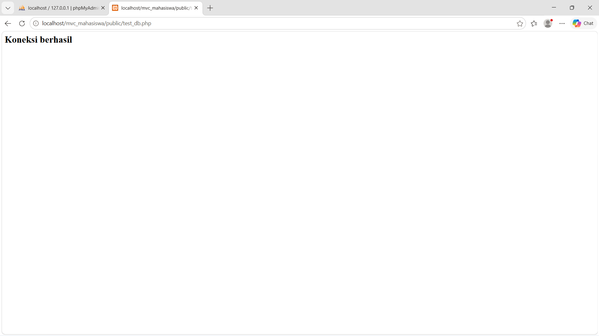

# Aplikasi MVC Mahasiswa

## Kelompok

- Anggota 1 : Backend
- Anggota 2 : Frontend
- Anggota 3 : Dokumentasi

## Arsitektur

Aplikasi menggunakan pola MVC:

- Model
- View
- Controller

## Cara Menjalankan

1. Clone repository
2. Pindahkan ke xampp/htdocs
3. Import database
4. Jalankan Apache dan MySQL
5. Buka:

http://localhost/mvc_mahasiswa/public

## Fitur

- CRUD Mahasiswa
- Search
- Filter
- Export CSV
- Export PDF
- Bootstrap Responsive

# Screenshot

## Sesi 1

## Sesi 2

## Sesi 3

## Sesi 4

## Sesi 5

## Sesi 6

## Sesi 7

## Sesi 8

## Tugas Akhir

## Repository

https://github.com/username/mvc_mahasiswa